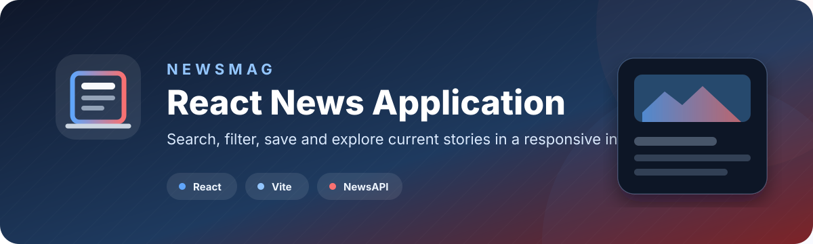

<p align="center">
  
</p>

<p align="center">
  
  
  
</p>

## Overview

**NewsMag** is a responsive React news reader with categories, search, saved stories, themes, skeleton loading, and article cards. Its Node proxy keeps the NewsAPI key out of the Vite bundle and browser network requests.

## Security architecture

```text
React browser -> /api/news -> Node proxy -> NewsAPI
                              key added here ^
```

- The server reads `NEWS_API_KEY`; the frontend has no `VITE_API_KEY`.
- The proxy uses the `X-Api-Key` header instead of exposing a key in URLs.
- Search length, category, page, and page-size inputs are restricted.
- API calls are rate-limited and time out after eight seconds.
- Error responses do not reveal upstream credentials.

## Run locally

```bash
git clone https://github.com/nuru999/News-App.git
cd News-App/News-app
npm install
cp .env.example .env
```

Set `NEWS_API_KEY` in `.env`, then start the API and frontend in separate terminals:

```bash
# Terminal 1
set -a && source .env && set +a
npm run dev:api

# Terminal 2
npm run dev
```

Vite proxies `/api` requests to `http://localhost:3001` during development.

## Production warning

NewsAPI's free Developer plan is for development and testing only. Do not deploy this application publicly with that plan. Before a public deployment, either:

1. Upgrade to a NewsAPI plan that permits production use.
2. Replace NewsAPI with a provider whose licence permits the intended public use.
3. Keep the project as a local portfolio demonstration.

After the licence requirement is resolved, Render can build and serve the combined app with:

- Build command: `cd News-app && npm install && npm run build`
- Start command: `cd News-app && npm start`
- Secret environment variable: `NEWS_API_KEY`
- Health check: `/api/health`

---

<p align="center">Built by <a href="https://github.com/nuru999">Nuru Amudi</a>.</p>
